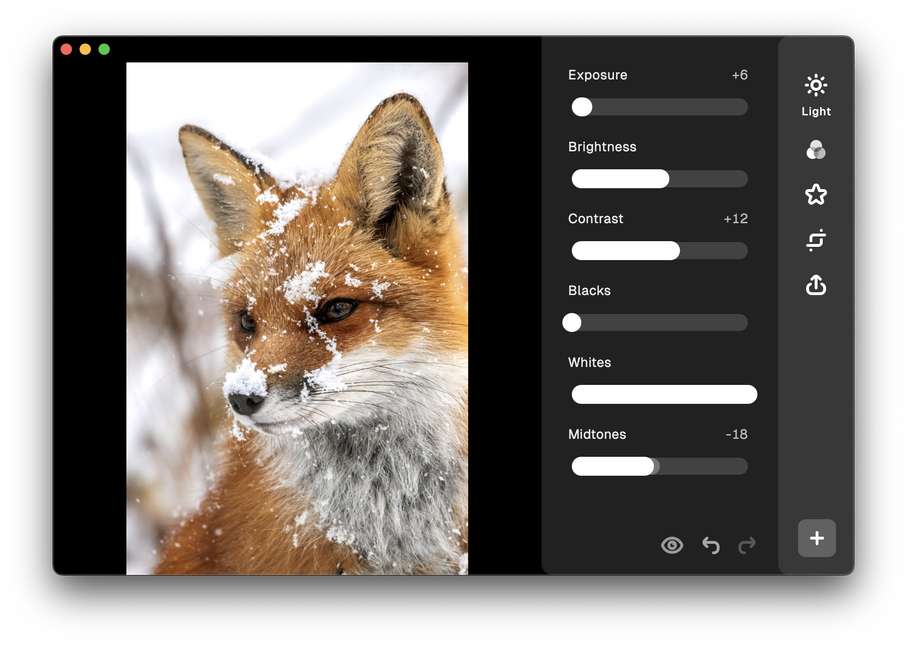

  

  # Sly

  A friendly image editor

  

# About the Project

Sly is a friendly image editor that requires no internet connection or preexisting expertise. Just open a photo and have at it.

The app  allows you to adjust attributes like brightness or contrast as well as add effects like a vignette or a border. It also allows you to flip, rotate and crop the image to your heart's desire. If you're a pro, you can even preview your edits on a histogram.

When you're done, just export the photo as a JPEG or a PNG with the quality settings of your choosing. You also get a choice in whether or not to keep metadata such as location information.

# Installation

## Linux

The app is available on Flathub.

## Other Platforms

I'm planning to make the app available for all other major platforms (Android, iOS, macOS, Windows) in the near future.

For now, if you want to try out the app, you can do so at [sly.kramo.page](https://sly.kramo.page). Be aware that this version is unstable and the performance will probably be significantly worse than that of the native app.

**Issues for each platform can be found here:**

- Android - https://github.com/kra-mo/sly/issues/12
- iOS - https://github.com/kra-mo/sly/issues/11
- macOS - https://github.com/kra-mo/sly/issues/9
- Windows - https://github.com/kra-mo/sly/issues/10

# Contributing

If you would like to contribute a feature or an enhancement, please open an issue or [reach out](https://kramo.page/about/) before doing so, so that we can discuss details before an implementation.

Small bug fixes are always appreciated!

## Localization

For now, localization of the app is not possible, but I plan to set up translations in the near future.

# Roadmap

The roadmap for the project is available [here](https://github.com/users/kra-mo/projects/4).
